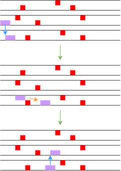

# CSE230-Project

2022 Fall CSE230 Project repo

Team members:

Xiaotong Lin  xil162@ucsd.edu
Kanlin Wang (kaw008@ucsd.edu)
Dingxian Wang diw021@ucsd.edu
Yen-Ju Tseng ytseng@ucsd.edu

# Proposal

## Overview

We are planning to build a parkour game that allows users to control the character to elude the obstacles and collect the coins on three tracks. The score of the game is calculated by summing up the points that get from collected coins and the time it spends. 

### Illustration 

## Features

### Map
There are three roads that the character can move. The obstacles and coins will appear randomly on the roads. Users need to avoid touching the obstacles by controlling the character to move to different roads or jumping up in the same direction. 

### Obstacles
The obstacles (shown as red squares) are generated randomly. The obstacles either appear at the bottom, which the character can elude by moving to other roads or jumping up, or appear on the top, which the character can elude by not jumping up. 

### Collision
There are two kinds of collisions in the game. First, if the character touches the obstacles, the game ends and the current score is returned. Second, if the character touches the coins, the score increases by a certain amount and the coin will disappear. 

### Character (The target Box)
The character has several motions. First, the character can use the arrow keys to switch the roads, as shown in blue arrows. Second, the character has the ability to jump up using the space key and escape the obstacles, as shown in orange arrows. The motion of the character is controlled by three keys in the keyboard: the Up/Down key controls the motion of moving to other roads, and the Space key controls the motion of jump up. 

### Score
The score is initialized as 0. The score increases automatically by a certain ratio if the game is running. As the game is running, the score also increases by the action of colliding coins. If the game ends, the current score is returned. After the game is over, players can check their scores, and quit the game or start a new one. 

###### Reference
https://github.com/samtay/snake
